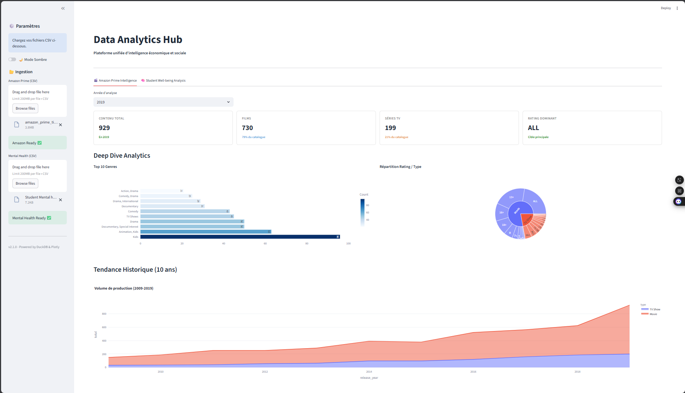
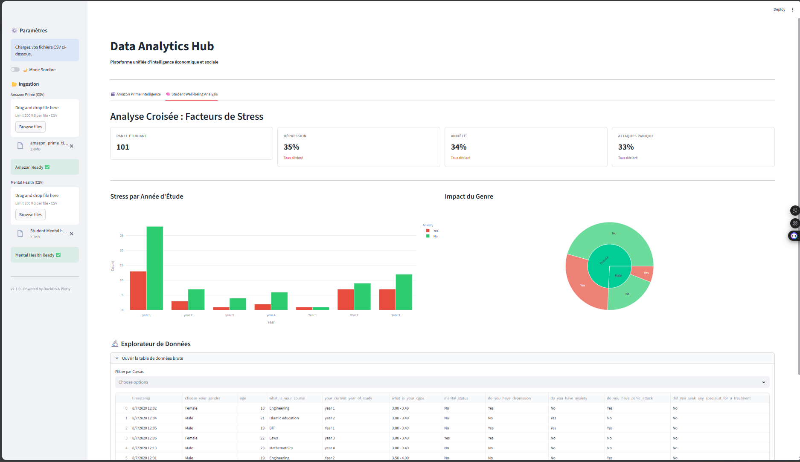

#  Data Analytics Hub : Amazon & Santé Mentale


Application web interactive **Full Stack Data** développée avec Streamlit et DuckDB. Ce projet permet l'analyse croisée de deux jeux de données distincts via une architecture "Multi-Tenant" (onglets) et propose une expérience utilisateur moderne.

---

##  Démonstration Visuelle

### 1. Intelligence Économique (Amazon Prime)
*Analyse temporelle, Sunburst Chart et KPIs financiers.*



### 2. Analyse Sociale (Santé Étudiante)
*Étude des facteurs de stress et corrélation anxiété/cursus.*


---

##  Fonctionnalités Clés

* **Ingestion de données** : Upload Drag & Drop de fichiers CSV.
* **Base de données In-Memory** : Utilisation de **DuckDB** pour des requêtes SQL analytiques ultra-rapides.
* **Visualisation Avancée** : Intégration de **Plotly Express** pour des graphiques interactifs (Zoom, Survol, Sunburst).
* **Expérience Utilisateur (UX)** :
    * Mode Sombre / Mode Clair (Dark Mode Toggle).
    * Cartes KPI stylisées via CSS personnalisé.
* **Nettoyage automatique** : Normalisation des colonnes CSV à la volée.
* **Filtres dynamiques** : Filtrage SQL en temps réel par année ou cursus.

##  Architecture Technique

* **Frontend** : Python + Streamlit (avec injection CSS).
* **Backend** : DuckDB (Mode In-Memory OLAP).
* **Manipulation** : Pandas (ETL léger).
* **Visualisation** : Plotly Express & Graph Objects.

###  Justification Business
Le projet simule deux départements d'entreprise :
1.  **Amazon Prime (Produit)** : Analyse de l'inventaire et de la stratégie de contenu (Année, Durée, Pays).
2.  **Santé Étudiante (RH/Social)** : Analyse du bien-être des populations (Dépression, Anxiété, Impact des études).

---

##  Installation et Exécution

1.  **Cloner le dépôt**
    ```bash
    git clone <votre-lien-git>
    cd <nom-du-dossier>
    ```

2.  **Créer un environnement virtuel**
    ```bash
    # Mac/Linux
    python3 -m venv venv
    source venv/bin/activate
    
    # Windows
    python -m venv venv
    .\venv\Scripts\activate
    ```

3.  **Installer les dépendances**
    ```bash
    pip install -r requirements.txt
    ```

4.  **Lancer l'application**
    ```bash
    streamlit run app.py
    ```

---

##  Équipe Projet

* **Lilian NGOUNGOU** 
* **Clément CORNUAULT** 
* **Ruth NGO MBEM**
* **Johann THEBAULT** 
* **Godwin Ayita** 